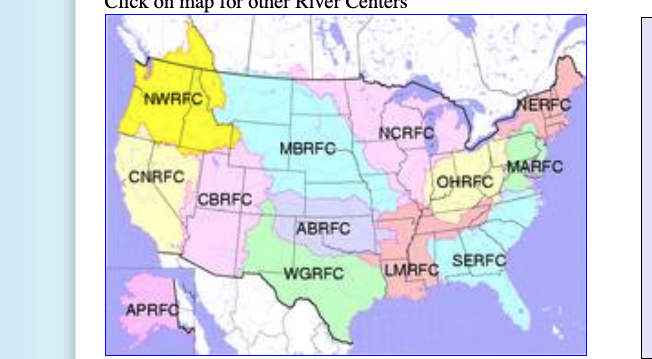

# General APIs/Relevant Links

- National water prediction service https://api.water.noaa.gov/nwps/v1/docs/
- Map of forecasts for entire us https://water.noaa.gov
  - Unclear what API this is using
- Links to other APIs: https://water.noaa.gov/about/api
  - NWPS API
  - NWPS Hydrologic Ensemble Forecast Service (HEFS) API (Experimental)

# Basin Forecasts

- Missouri Basin forecast center: https://www.weather.gov/mbrfc
  - Appears to be using https://api.water.noaa.gov/nwps/v1/gauges/MILM8/stageflow
- Northwest River forecast center https://www.nwrfc.noaa.gov/rfc/
- Arkansas Basin forecast center: https://www.weather.gov/abrfc
- West gulf river forecast center: https://www.weather.gov/wgrfc
- California / Nevada river forecast center https://www.cnrfc.noaa.gov/
- Colorado Basin River Forecast Center https://www.cbrfc.noaa.gov/lmap/lmap.php
  - Seems to fetch differently from other basins: uses https://www.cbrfc.noaa.gov/dbdata/station/flowgraph/flowcond_data.py?otype=js&skey=id&ts=1744119080512
  - https://www.cbrfc.noaa.gov/dbdata/station/ensgraph/map/ensmap.html Doesn't appear to load

    

# Weather Forecasts

- https://mapservices.weather.noaa.gov/vector/rest/services/precip/wpc_qpf/MapServer
