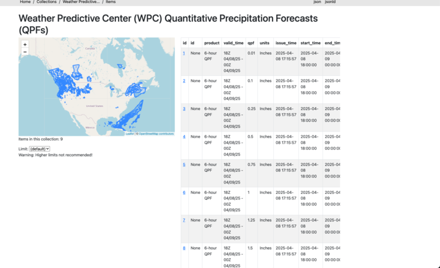

This directory holds the integration for noaa quantitative precipitation forecasts. Since we can use the ESRI provider we don't need to add any new python.

The forecast is represented as a series of overlapping geojson features. All areas of the US with qpf of a specific value will be grouped together in the same feature.
