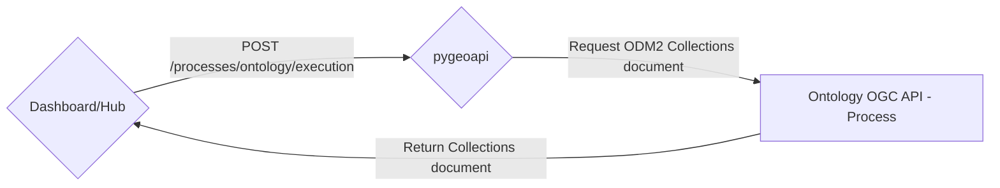
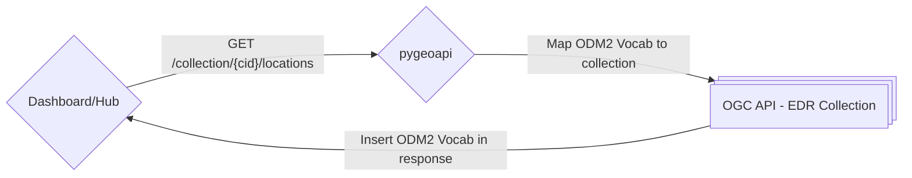
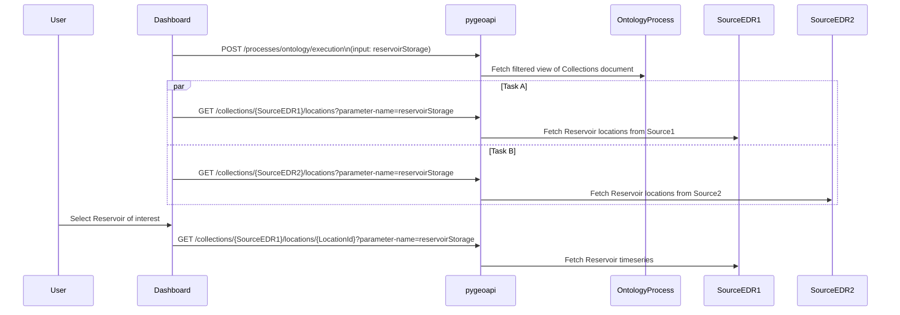

# Ontology

The Ontology abstraction layer serves to map standardized ODM2 parameters
to the associated parameters in multiple different upstream APIs. This allows user interfaces to
use consistent language when refering to parameters of interest.

The Ontology consists of two separate utilities:

1. **OGC API - Process** that takes in an optional list of ODM2 Vocabulary
   terms. The process formats a version of the `Collections` document,
   compliant with *http://www.opengis.net/spec/ogcapi-edr-1/1.1/req/collections*,
   with ODM2 parameters and units replacing the native values from the source
   system while staying compliant with [Requirement A.25](https://docs.ogc.org/is/19-086r6/19-086r6.html#req_edr_rc-parameters).
   When the list of ODM2 terms is provided, only terms in that list will
   be in the returned collections JSON document. The general behavior can be 
   seen in the diagram below:



2. **OGC API - EDR** endpoint interceptor that maps ODM2 parameters
   to the parameters of the source system for the EDR Query. This formats
   the returned CoverageJSON from an EDR Query to use the ODM2 parameter
   provided in the request. Should there be multiple unit representations,
   the response Coverages are converted to the requested unit. This will
   not change the output of the GeoJSON. The general behavior can be 
   seen in the diagram below:



### Dashboard

The Reservoir Storage Dashboard allows a streamlined view of Reservoir
Storage Data. Optional additional views of precipitation forecast and
streamgage data may also be made available in this view. In the diagram
below OntologyProcess, SourceEDR1, and SourceEDR2 are all endpoints of
a _single_ pygeoapi server.



This example uses the Reservoir Storage parameter, representated
at *http://vocabulary.odm2.org/variablename/reservoirStorage/* but is
refered to with shorthand, _reservoirStorage_. The same pattern could
be repeated with *http://vocabulary.odm2.org/variablename/streamflow/* for
streamgage data.

<!-- Precipitation forecast data is not made availible as **OGC API - EDR**. As such,
the layer will not will presentable via the Ontology. The diagram below
illustrates a simple **OGC API - Features** interaction.

```mermaid
sequenceDiagram
    participant User
    participant Dashboard
    participant pygeoapi

    %% Selection of Forecast period of interest (1-7 Days)
    User->>Dashboard: Select Forecast for Days 1, 2, 3, 4-5, or 6-7

    %% Fetch GeoJSON of Forecast
    Dashboard->>pygeoapi: GET /collections/{ForcastPeriod}/items

``` -->

### Hub

The Hub serves as the primary interface to explore and download
data from the Western Water Datahub. It makes greater use out of the
Ontology layer, with a larger set of possible parameters to filter by.
Furthermore, the Hub is going to enable the full suite of EDR query
parameters by also enable users to filter spatiotemporally.

```mermaid
sequenceDiagram
    participant User
    participant Hub
    participant pygeoapi
    participant OntologyProcess
    participant SourceEDR1
    participant SourceEDR2
    participant SourceEDR3

    %% Initial discovery via process execution
    Hub->>pygeoapi: POST /processes/ontology/execution
    pygeoapi->>OntologyProcess: Fetch ODM2 representation of Collections document

    User->>Hub: Select parameter(s) or parameter group(s) of interest

    opt Refresh Collections with desired parameters
        Hub->>pygeoapi: POST /processes/ontology/execution\n(input: streamflow)
        pygeoapi->>OntologyProcess: Fetch filtered view of Collections document
    end

    User->>Hub: Add additional Spatiotemporal filters

    opt Filter by provider
        User->>Hub: Choose specific provider(s)
        Hub->SourceEDR1: Ignores SourceEDR1 collection metadata
    end

    %% Show locations matching filters
    par Task A
        Hub->>pygeoapi: GET /collections/{SourceEDR2}/locations?parameter-name=streamflow
        pygeoapi->>SourceEDR2: Fetch Streamflow locations from Source2
    and Task B
        Hub->>pygeoapi: GET /collections/{SourceEDR3}/locations?parameter-name=streamflow
        pygeoapi->>SourceEDR3: Fetch Streamflow locations from Source3
    end

    User->>Hub: Select Site of interest
    Hub->>pygeoapi: GET /collections/{SourceEDR2}/locations/{LocationId}?parameter-name=streamflow
    pygeoapi->>SourceEDR2: Fetch Streamflow timeseries from Source2
```
