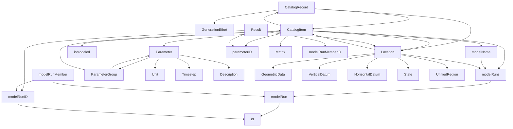

# [RISE API](https://data.usbr.gov/rise-api) Overview

There are a series of [primary endpoints](#primary-endpoints). Then there are managed vocabularies which are essentially helpers and enumerate the data contained within other primary endpoints.

Finally there are a list of datatypes that describe the dataformat and mimic the layout of the underlying table.

## Primary Endpoints

- CatalogItem
- CatalogRecord
- Location
- Parameter
- Result

## Managed Vocabularies

- CatalogThemeType
- GenerationEffort
- ItemStructure
- LocationType
- ModelName
- ModelRun
- ModelRunMember
- ParameterGroup
- ReclamationRegion
- State
- SubTheme
- UnifiedRegion

## Layout of the underlying data tables

From a first pass, the underlying data tables seem to map closely to the data that is output. The main differences are associated with naming conventions where the table may have a primary key named `xID` whereas the data may output it as `/x/id` and have `id` as the identifier. Additionally, items in the database are called CatalogItems in the API.

Some of the information regarding entityID and ownerID is not exposed publicly, presumably for privacy reasons (i.e. it includes the email of whoever maintains the data). Other info not exposed publicly include elements in the item table about the file path for metadata or some of the more specific data regarding where the item is published.

## Data Type Layout

CatalogRecord contains multiple CatalogItems.
CatalogItems are associated with one or more locations and parameters.
Parameters are associated with a ParameterGroup.
Parameters contain a unit, timestep, and description.
ParameterGroups contain multiple parameters.
CatalogItems contain a pointer back to the CatalogRecord
A CatalogRecord is created from a generationEffort.
Locations contain geometric data.
Results are not linked to any other endpoint and are queried independently.
Results output a location but it is a one way link. Locations do not directly link to results but you can get to a result by linking back to the catalogItem.

Each result is associated with a modelRunMemberId as well as a modeRunID. Each modelRunMember outputs a modelRunId as well as an ID. Confusingly, the modelRun has both an id and an itemId. However, the ID of the modelRun is how a result can be linked to a parameter and a location.

It is a bit unclear if the ID of the modelRun is the same as the modelRunID response.

It is a bit unclear if information in the model table solely corresponds to hypothetical data.



## CatalogItem

- Contains lots of meta info on description / temporal data / publication info.
- Primary data: matrix, item type, spatial Geometry/Resolution/Transformation
  - Contains a catalog record. With this record we can then retrieve more metadata

## CatalogRecord

- Contains multiple `catalogItems`
- Contains location, upload metadata, generation Effort, program names, associated themes, tags, etc
  - Once we get this we can link between items

## Location

- includes all information about a given location (id, geometry, states, any associated catalog items/Records, project names)

```json
{
  "data": {
    "id": "/rise/api/location/1",
    "type": "Location",
    "attributes": {
      "_id": 1,
      "locationParentId": null,
      "locationName": "Marys Lake",
      "locationDescription": null,
      "locationStatusId": 1,
      "locationCoordinates": {
        "type": "Point",
        "coordinates": [-105.5343083, 40.3440796]
      },
      "elevation": "8050.000000",
      "createDate": "2020-08-12T10:08:06+00:00",
      "updateDate": "2021-11-17T09:07:16+00:00",
      "horizontalDatum": {
        "_id": "WGS84",
        "definition": "World Geodetic System of 1984"
      },
      "locationGeometry": {
        "_id": 3,
        "locationGeometry": "point",
        "definition": "A single x-y point",
        "createDate": "2018-10-02T14:30:27+00:00"
      },
      "timezone": "MT",
      "verticalDatum": {
        "_id": "NAVD88",
        "definition": "North American Vertical Datum of 1988"
      },
      "locationTags": [
        {
          "id": 10,
          "tag": "Missouri River Basin",
          "createDate": "2019-01-29T11:16:01+00:00"
        }
      ],
      "relatedLocationIds": null,
      "projectNames": [],
      "locationTypeName": "Lake/Reservoir",
      "timezoneName": "Mountain Standard Time",
      "timezoneOffset": -7,
      "locationRegionNames": ["Great Plains"],
      "locationUnifiedRegionNames": ["Missouri Basin"]
    },
    "relationships": {
      "states": {
        "data": [
          {
            "type": "State",
            "id": "/rise/api/state/CO"
          }
        ]
      },
      "locationUnifiedRegions": {
        "data": [
          {
            "type": "UnifiedRegion",
            "id": "/rise/api/unified-region/5"
          }
        ]
      },
      "catalogRecords": {
        "data": [
          {
            "type": "CatalogRecord",
            "id": "/rise/api/catalog-record/4023"
          }
        ]
      },
      "catalogItems": {
        "data": [
          {
            "type": "CatalogItem",
            "id": "/rise/api/catalog-item/4222"
          },
          {
            "type": "CatalogItem",
            "id": "/rise/api/catalog-item/4223"
          },
          {
            "type": "CatalogItem",
            "id": "/rise/api/catalog-item/4225"
          }
        ]
      }
    }
  }
}
```

## Parameter

Represents the natural language description of and the units for some sort of datapoint that is monitored at a given location.

```json
{
  "links": {
    "self": "/rise/api/parameter?itemsPerPage=3&page=1",
    "first": "/rise/api/parameter?itemsPerPage=3&page=1",
    "last": "/rise/api/parameter?itemsPerPage=3&page=233",
    "next": "/rise/api/parameter?itemsPerPage=3&page=2"
  },
  "meta": {
    "totalItems": 698,
    "itemsPerPage": 3,
    "currentPage": 1
  },
  "data": [
    {
      "id": "/rise/api/parameter/1688",
      "type": "Parameter",
      "attributes": {
        "_id": 1688,
        "parameterGroupId": 31,
        "parameterName": "Chinook Wild Count",
        "parameterCode": null,
        "parameterDescription": "Count of total number \"Wild\" or Non-Adipose-Clipped Chinook Salmon (Oncorhynchus tshawytscha)",
        "parameterTimestep": "every two hours",
        "parameterTransformation": "sum",
        "parameterUnit": "count",
        "createDate": "2022-11-29T23:15:26+00:00",
        "updateDate": "2022-12-13T15:23:41+00:00",
        "parameterGroup": "Macrobiological Characteristics"
      },
      "relationships": {
        "parameterGroupEntity": {
          "data": {
            "type": "ParameterGroup",
            "id": "/rise/api/parameter-group/31"
          }
        }
      }
    },
    {
      "id": "/rise/api/parameter/1687",
      "type": "Parameter",
      "attributes": {
        "_id": 1687,
        "parameterGroupId": 31,
        "parameterName": "Chinook Hatchery Count",
        "parameterCode": null,
        "parameterDescription": "Count of total number Hatchery or Adipose-Clipped Chinook Salmon (Oncorhynchus tshawytscha)",
        "parameterTimestep": "every two hours",
        "parameterTransformation": "sum",
        "parameterUnit": "count",
        "createDate": "2022-11-29T23:14:16+00:00",
        "updateDate": "2022-12-13T15:23:45+00:00",
        "parameterGroup": "Macrobiological Characteristics"
      },
      "relationships": {
        "parameterGroupEntity": {
          "data": {
            "type": "ParameterGroup",
            "id": "/rise/api/parameter-group/31"
          }
        }
      }
    }
  ]
}
```

## Result

Represents the actual datapoint with a context header
Not entirely clear how to link a result to a parameter since it neither outputs or takes in the param. It does however take in a location.

```json
"dateTime": "2020-06-10 07:00:00",
"result": 10845800,
"timeStep": "day",
"resultType": "observed"
```

# Managed Vocabularies

## CatalogThemeType

- A general description / keyword for a project

```json
{
  "links": {
    "self": "/rise/api/catalog-theme-type?itemsPerPage=25"
  },
  "meta": {
    "totalItems": 10,
    "itemsPerPage": 25,
    "currentPage": 1
  },
  "data": [
    {
      "id": "/rise/api/catalog-theme-type/1",
      "type": "CatalogThemeType",
      "attributes": {
        "_id": 1,
        "theme": "Water",
        "definition": "Relating to water resources, including water operations, weather, and climate.",
        "createDate": "2018-06-25T15:11:38+00:00"
      }
    },
    {
      "id": "/rise/api/catalog-theme-type/2",
      "type": "CatalogThemeType",
      "attributes": {
        "_id": 2,
        "theme": "Water Quality",
        "definition": "Relating to the suitability of water for a particular use based on selected physical, chemical, and biological characteristics.",
        "createDate": "2018-06-25T15:11:38+00:00"
      }
    },
    {
      "id": "/rise/api/catalog-theme-type/3",
      "type": "CatalogThemeType",
      "attributes": {
        "_id": 3,
        "theme": "Biological",
        "definition": "Relating to the structure, function, growth, evolution, and distribution of organisms.",
        "createDate": "2018-06-25T15:11:38+00:00"
      }
    },
    {
      "id": "/rise/api/catalog-theme-type/4",
      "type": "CatalogThemeType",
      "attributes": {
        "_id": 4,
        "theme": "Environmental",
        "definition": "Relating to the natural world and the impact of human activity on its condition.",
        "createDate": "2018-06-25T15:11:38+00:00"
      }
    }
  ]
}
```

## GenerationEffort

A generationEffort is essentially some sort of project with associated funding.

- Gets the list of generation efforts by id, not much more.

```json
{
  "links": {
    "self": "/rise/api/generation-effort?itemsPerPage=25&page=1",
    "first": "/rise/api/generation-effort?itemsPerPage=25&page=1",
    "last": "/rise/api/generation-effort?itemsPerPage=25&page=14",
    "next": "/rise/api/generation-effort?itemsPerPage=25&page=2"
  },
  "meta": {
    "totalItems": 340,
    "itemsPerPage": 25,
    "currentPage": 1
  },
  "data": [
    {
      "id": "/rise/api/generation-effort/1",
      "type": "GenerationEffort",
      "attributes": {
        "_id": 1,
        "generationEffort": "Missouri Basin and Arkansas-Rio Grande-Texas-Gulf Water Operations Monitoring",
        "createDate": "2021-02-04T11:55:19+00:00"
      }
    },
    {
      "id": "/rise/api/generation-effort/2",
      "type": "GenerationEffort",
      "attributes": {
        "_id": 2,
        "generationEffort": "Invasive Mussel Early Detection and Monitoring",
        "createDate": "2021-02-04T11:55:19+00:00"
      }
    }
  ]
}
```

## LocationGeometry

- Straightforward, just the geometric point
- defines the data format in the locationCoordinates

## Other Datatypes

There are a series of other datatypes that are defined in the API and are returned from the other endpoints. Generally, these are less important, don't link to other info, and just describe the specifics of the data formats that are returned.
