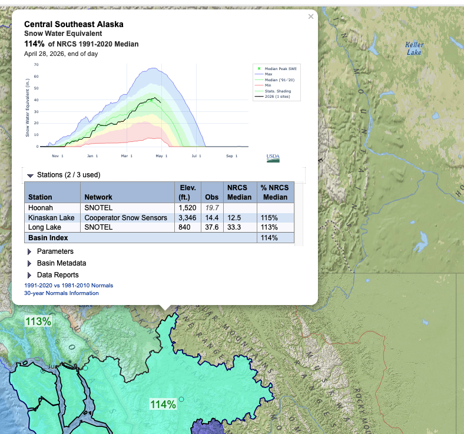

# SNOTEL Snow Water Equivalent Basin Index Percentage / Percent Normal

This package calculates the basin index percentage (also known as the percent normal) of Snow Water Equivalent (SWE) for each HUC06 basin based on the values from all SNOTEL stations within that basin.  Background on what this is and why it is useful can be found [here](https://www.climatehubs.usda.gov/hubs/northwest/topic/percent-normal) on the USDA NRCS website.

To calculate the Basin Index Percentage for a specific HUC6 basin, the calculation is defined by the ratio of the sum of the observed values to the sum of the reference normals (defined as the median value for the day-month from 1991-2020) across all qualifying stations within that basin. 

This package generally aims to recreate the logic which generates the [NWCC Interactive Map](https://nwcc-apps.sc.egov.usda.gov/imap/#version=2&elements=&networks=!&states=AK,ID,OR,WA&basins=!&hucs=&minElevation=&maxElevation=&elementSelectType=any&activeOnly=true&activeForecastPointsOnly=false&hucLabels=false&hucIdLabels=false&hucParameterLabels=true&stationLabels=&overlays=&hucOverlays=2&basinOpacity=75&basinNoDataOpacity=25&basemapOpacity=100&maskOpacity=0&mode=data&openSections=dataElement,parameter,date,basin,options,elements,location,networks&controlsOpen=true&popup=&popupMulti=&popupBasin=&base=esriNgwm&displayType=basinstation&basinType=6&dataElement=WTEQ&depth=-8&parameter=PCTMED&frequency=DAILY&duration=I&customDuration=&dayPart=E&monthPart=E&forecastPubDay=1&forecastExceedance=50&useMixedPast=true&seqColor=1&divColor=7&scaleType=D&scaleMin=&scaleMax=&referencePeriodType=POR&referenceBegin=1991&referenceEnd=2020&minimumYears=20&hucAssociations=true&relativeDate=-1&lat=43.908&lon=-115.232&zoom=6.0) using the same stations as listed in the Station dropdown of the response.

The resulting geojson feature response for each HUC06 with its associated mean can be found in the Western Water Datahub API [here](https://api.wwdh.internetofwater.app/collections/snotel-huc06-means/items?f=html)

## Formula

$$
I_j = 100 \times \frac{\sum_{i \in S'_j} V_{i,t}}{\sum_{i \in S'_j} N_{i,t}}
$$

**Constraint:**

$$
\sum_{i \in S'_j} N_{i,t} \neq 0
$$
### Variable Definitions

| Variable | Description |
|----------|-------------|
| I_j | Basin Index (percentage) for HUC6 basin \( j \) |
| S'_j | Set of all SNOTEL stations \( i \) within basin \( j \) that have both an observed value and a normal for the given time \( t \) |
| V_{i,t} | Observed value (e.g., SWE) for station \( i \) at time \( t \) |
| N_{i,t} | 30-year median (1991–2020) for station \( i \) at time \( t \) |
| i | Individual station index |
| j | HUC6 basin index |
| t | Time index (date or period) |

## Data Sourcing 

Although the NRCS does not explicitly document its data calculation process, the source datasets can be downloaded and ingested to produce the basin index calculation using the following URL links.

- NRCS publishes:
    - The 30-year snow water equivalentmedians for each station, organized by day-month here: https://nwcc-apps.sc.egov.usda.gov/awdb/data/WTEQ/DAILY/MED/
    - The mapping of snotel stations to HUC06 here: https://nwcc-apps.sc.egov.usda.gov/awdb/basin-defs/site-lists/HUC6_WTEQ.json
    - The daily snow water equivalent for each station here: https://nwcc-apps.sc.egov.usda.gov/awdb/data/WTEQ/DAILY/OBS/WTEQ_DAILY_OBS_{month_and_date}.json (replace the month and date with the current month and date i.e. `01-01` -> https://nwcc-apps.sc.egov.usda.gov/awdb/data/WTEQ/DAILY/OBS/WTEQ_DAILY_OBS_01-01.json )

## Code

The associated logic to produce the basin index / percent normal calculation can be found [here](./snotel_means/lib/locations.py)

The geometry for each HUC06 is source from the [Geoconnex Reference Feature Server](https://reference.geoconnex.us/collections/hu06). Any HUC06 without any SNOTEL stations within it will not be included in the response.
